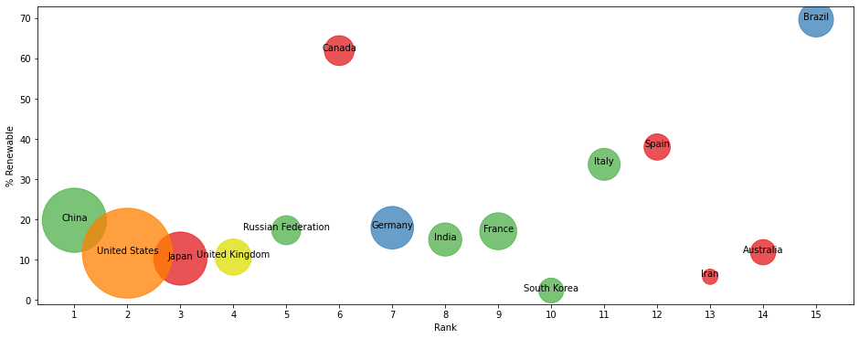

# Advanced Data Analysis with Pandas

In this notebook, we will analyse the % reneable energy with respect to a country's population, For that we will use:
- `Energy Indicators.xls`, which is a list of indicators of [energy supply and renewable electricity production](Energy%20Indicators.xls) from the [United Nations](http://unstats.un.org/unsd/environment/excel_file_tables/2013/Energy%20Indicators.xls) for the year 2013.
- `world_bank.csv`, which is a csv containing countries' GDP from 1960 to 2015 from [World Bank](http://data.worldbank.org/indicator/NY.GDP.MKTP.CD). Call this DataFrame **GDP**. 
- [Sciamgo Journal and Country Rank data for Energy Engineering and Power Technology](http://www.scimagojr.com/countryrank.php?category=2102) from the file `scimagojr-3.xlsx`, which ranks countries based on their journal contributions in the aforementioned area. Call this DataFrame **ScimEn**.

We will use pandas to answer the following questions:
- Data Manipulation and Cleaning
- Data cleaning analysis
- What is the average GDP over the last 10 years for each country?
- By how much had the GDP changed over the 10 year span for the country with the 6th largest average GDP?
- What is the mean `Energy Supply per Capita`?
- What country has the maximum % Renewable and what is the percentage?
- What is the maximum value for this new column, and what country has the highest ratio?
- What is the third most populous country according to this estimate?
- What is the correlation between the number of citable documents per capita and the energy supply per capita? 
- Check if a country uses high renewable energy.
- What is each continent's population?
- How many countries are in each of the groups?
- Convert the Population Estimate series to a string with thousands separator (using commas).

Here is a visulization I created to understand the data better

This is a bubble chart showing % Renewable vs. Rank. The size of the bubble corresponds to the countries' 2014 GDP, and the color corresponds to the continent.