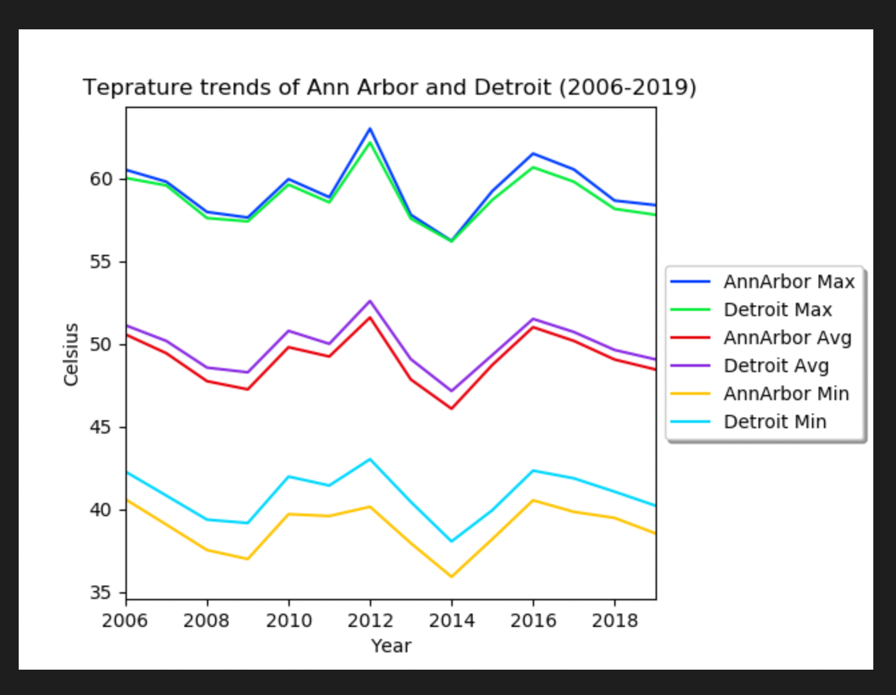

# Temprature trends of Ann Arbor and Detroit (2006-2019)

In this notebook, I will use Cairo’s principles of truth, beauty, function, and insight to answer the research question: "Has the temprature trend changed in Ann Arbor and Detroit over the last few years?" 

The data used in this notebook is taken from the World Bank's website. 

Here are the trends made in this notebook
